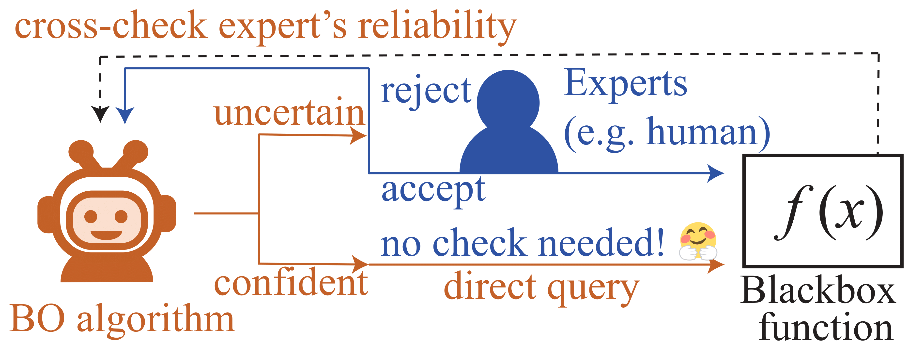

# COBOL: Collaborative Bayesian Optimization with Labelling Experts

This repository contains the Python code that was presented for the following paper.

[1] Wenjie Xu*, Masaki Adachi*, Colin N. Jones, Michael A. Osborne, Principled Bayesian Optimization in Collaboration with Human Experts. Advances in Neural Information Processing Systems 35 (NeurIPS; **Spotlight**), 2024 <br>
Links: NeurIPS proceedings, arXiv, OpenReview <br>
*: Equal contribution

## Brief explanation
<br>

**BO-expert collaboration framework**: The algorithm (red) decides if an expert's (blue) label is necessary. If rejected, it generates a different candidate; otherwise, it directly queries.

## Tutorials for practitioners/researchers
We prepared detailed explanations about how to use COBOL for your tasks. <br>
See `tutorial.ipynb`.

## Installation
COBOL needs the following libraries.
```
pip install gpytorch botorch casadi 
```

## Cite as
Please cite this work as
```
@article{xu2024principled,
  title={Principled Bayesian Optimization in Collaboration with Human Experts},
  author={Xu, Wenjie and Adachi, Masaki and Jones, Colin N and Osborne, Michael A},
  journal={https://doi.org/10.48550/arXiv.2410.10452},
  year={2024}
}
```
